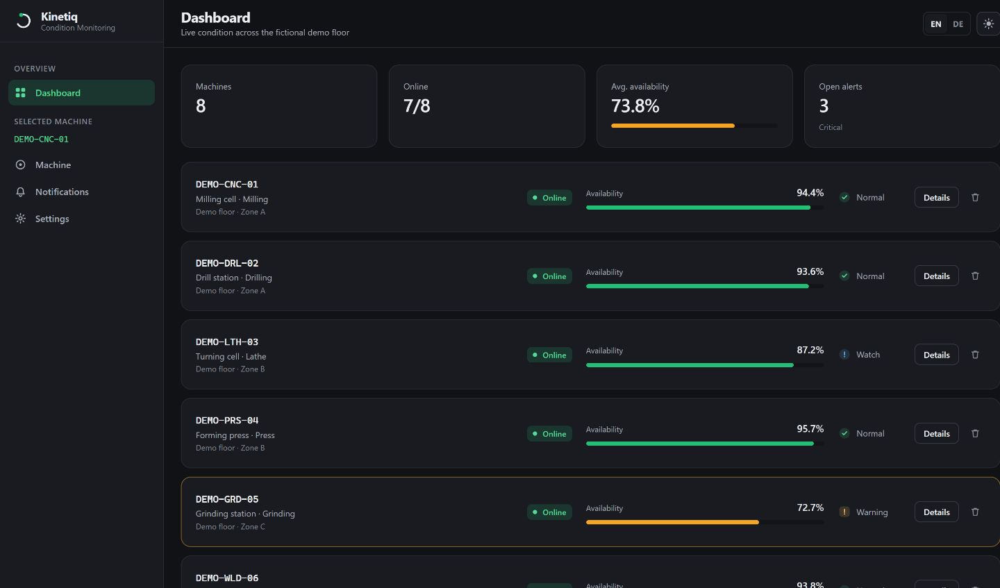
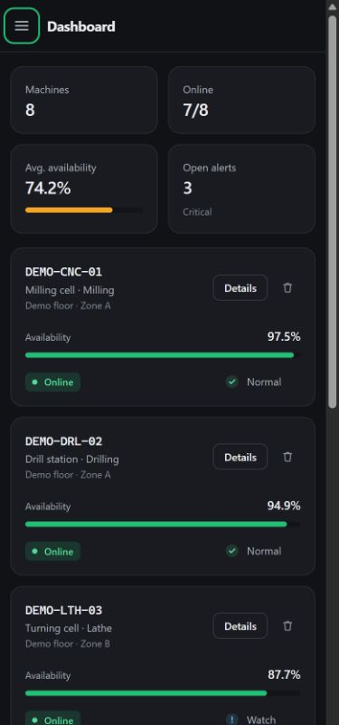
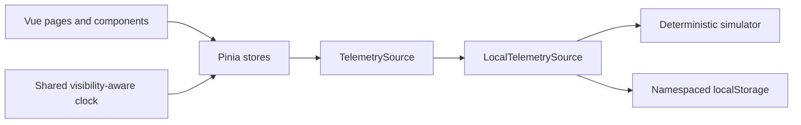

# Kinetiq

[](https://github.com/Saandu/kinetiq/actions/workflows/verify.yml)

Kinetiq is a browser-based condition-monitoring demo that shows which fictional factory machines need attention and when.

**Live demo:** [https://kinetiq-dashboard.web.app](https://kinetiq-dashboard.web.app)

Built by **[Alexandru Lungu](https://github.com/Saandu)** · Vue 3 · TypeScript · Pinia



This repository is a standalone 2026 portfolio project. All machine identities,
locations, telemetry, thresholds and events are fictional and generated for the
demo. It has no backend, database, authentication, credentials or runtime API
calls.

## Try it in two minutes

1. Open **Details** on a machine to inspect availability, operating states and
   illustrative maintenance windows. Page 2 includes an offline conveyor and a
   critical cooling pump.
2. Toggle maintenance mode or record a past maintenance action. Changes stay
   in your browser and survive a refresh.
3. Open **Settings**, rename an operating state or adjust the alert thresholds,
   then save that panel. Return to the dashboard to see the resulting severity.
4. Explore notification snapshots, switch English/German or light/dark mode,
   and try the mobile navigation.
5. Use **Settings → Reset demo data** to restore the starting data. No account,
   API key or setup is needed to explore the hosted demo.

## Background

This demo revisits a commercial project I built in 2023: the operator dashboard
for an industrial machine condition-monitoring system, delivered freelance for a
German manufacturer and deployed inside their plant.

That system read live sensor telemetry from real equipment out of an InfluxDB
time-series database, and published operator commands back to the factory over
MQTT — maintenance mode, fault logging, and the training hyperparameters of the
machine-learning model behind it. That made it a control surface rather than a
read-only report. Getting MQTT to work from a browser was the hardest part: the
protocol expects a raw TCP socket that browsers do not have, so it had to be
carried over WebSocket, with the Node-only client library polyfilled for the
bundler and the broker address resolved at runtime.

That codebase is private and client-owned. This repository shares none of its
code or data — it is a separate 2026 rebuild with fictional machines.

| | Paid client work, 2023 | Public portfolio rebuild, 2026 |
|---|---|---|
| Purpose | Operator dashboard for equipment inside the client's plant | Inspectable demonstration of the interface and engineering approach |
| Data | Real sensor telemetry with InfluxDB | Deterministic fictional telemetry |
| Controls | Operator commands published over MQTT | Local browser state only |
| Availability | Private, client-owned codebase | This repository and the hosted demo |

My contribution to the original project was the frontend and its integrations.
The public demo does not include the client's backend or machine-learning model.

## Engineering decisions

### A small interface without a UI framework

The application uses project-specific Vue components and hand-written CSS. That
keeps the runtime dependency set limited to Vue, Pinia, Vue Router and vue-i18n,
and avoids shipping a general component or charting system for a compact,
fixed-purpose interface. The cost is that accessibility and responsive behavior
must be implemented and reviewed in the local components.

### One data boundary

Telemetry reads and writes go through the `TelemetrySource` interface. The local implementation combines a
deterministic telemetry source with namespaced `localStorage`, keeping storage
details out of the UI.

Only the local adapter is implemented. Connecting a real service would require
an adapter and appropriate asynchronous, loading and failure handling; this
repository does not claim to ship Firestore, InfluxDB or MQTT adapters.

### Deterministic simulation

Generated values are derived from machine identity, field name and wall-clock
time. Reloading does not randomly move machines into unrelated states. At the
same time and with the same settings, generated values agree between tabs.
Explicit demo profiles ensure the dashboard
always contains a useful mix of healthy, warning, critical and offline states.

### One shared clock

A ref-counted timer updates one reactive timestamp for the whole application.
All live values derive from that timestamp, and updates pause while the tab is
hidden. Individual pages do not create polling loops.

### Visualisation follows the comparison

Operating-state distribution uses a stacked bar because the task is comparing
parts of a whole on a shared baseline. Ratios use simple meters. Severity is
also expressed with icon shape and text, so color is never the only signal.

## Stack

| Layer | Technology |
|---|---|
| UI | Vue 3 with TypeScript and `<script setup>` |
| State | Pinia |
| Routing | Vue Router |
| Internationalisation | vue-i18n, English and German |
| Styling and charts | Custom CSS and inline SVG |
| Build | Vite |
| Verification | Vitest, Vue Test Utils, TypeScript, GitHub Actions |
| Persistence | Browser `localStorage` |
| Hosting | Firebase Hosting as static files |

## Accessibility and mobile behavior

- Status combines color, icon shape and text.
- Interactive controls expose labels and focus-visible states.
- Reduced-motion preferences are respected.
- Touch targets expand on coarse pointers.
- Form controls use 16px text on touch devices because smaller controls cause
  iOS Safari to zoom the page on focus, which disrupts the layout.
- Drawers and dialogs lock and restore page scroll position.
- The mobile drawer contains keyboard focus, closes with Escape and restores
  focus. Closed navigation is inert; the page is inert while the drawer is open.
- A skip link leads directly to the main content.
- The layout accounts for dynamic mobile viewports and safe-area insets.

<details>
<summary>Mobile preview</summary>



</details>

## Run locally

Recommended: **Node.js 24.15+ (24.x)** and npm. `.nvmrc` selects Node 24.
The complete supported version range, including test tooling, is in `package.json`.

```bash
git clone https://github.com/Saandu/kinetiq.git
cd kinetiq
npm ci
npm run dev
```

Open [http://localhost:3100](http://localhost:3100).

```bash
npm run typecheck  # TypeScript and Vue checks
npm test           # behavior and regression tests
npm run verify     # tests, type checks and production build
npm run build      # type checks and production build in dist/
npm run preview    # serve the built application locally
```

No environment file or Firebase account is required to run locally.

## Verification and source tour

The [CI/CD workflow](.github/workflows/verify.yml) runs on branch pushes and pull
requests. It installs from the lockfile, runs `npm run verify`, and checks
production dependencies for high/critical advisories. A push or merged PR to
`main` then deploys the verified build to Firebase Hosting. Other branches and
pull requests cannot deploy. See [deployment details](docs/DEPLOYMENT.md).

The tests cover independent settings saves, immediate severity updates, invalid
thresholds, deterministic data, persistence and reset, blocked/corrupt storage,
shared timer cleanup, hidden-tab behavior and mobile drawer focus/scroll recovery.

They also cover the interface primitives, because the accessibility claims above
are the kind that quietly stop being true: that a field label is wired to the
control in its slot, that the switch is a `role="switch"` with `aria-checked`
rather than a styled div, that each severity draws its own *shape* and not only
its own colour, and that a dialog names itself, takes focus in, keeps Tab
inside, closes on Escape and hands focus back to whatever opened it.

See [the test suite](tests) and [the browser checklist](docs/VERIFICATION.md).
These checks are not a claim of exhaustive browser or accessibility coverage.

| Start here | What to inspect |
|---|---|
| [`telemetryService.ts`](src/services/telemetryService.ts) | Data contract, local adapter and stored-data normalization |
| [`simulator.ts`](src/services/simulator.ts) | Stable generated values and deliberate demo profiles |
| [`fleet.ts`](src/stores/fleet.ts) | Shared reactive clock, lifecycle and derived fleet status |
| [`settings.ts`](src/stores/settings.ts) | Draft state, per-panel saves and validation |
| [`components/ui`](src/components/ui) | 14 reusable interface primitives, covered by [`components.test.ts`](tests/components.test.ts) |
| [`tokens.css`](src/styles/tokens.css) | Shared typography, spacing, color and theme tokens |



There are four **direct runtime dependencies**. The build output reports gzip
sizes per file, including shared and lazy-loaded route chunks; a single main
bundle measurement should not be presented as the size of the whole app.

## Known limitations

- Telemetry is illustrative and should not be used for operational decisions.
- Browser storage is local to one device and can be cleared at any time.
- The demo has no multi-user workflow, authentication or server-side history.
- Alert configuration affects generated demo severity only.
- Mode switches record local intent; they do not stop equipment or a real feed.
- Local edits are not synchronized across tabs or devices.
- Prediction windows are illustrative, not the output of a predictive model.

## Copyright and permissions

Copyright (c) 2026 Alexandru Lungu. All rights reserved.

The source is public for portfolio review; this is not an open-source project.
Reuse, modification and redistribution require prior written permission,
except where applicable law or GitHub's Terms of Service permit otherwise.
Third-party dependencies and materials retain their own licenses.
See [LICENSE](LICENSE) for the full notice and permission requests.
